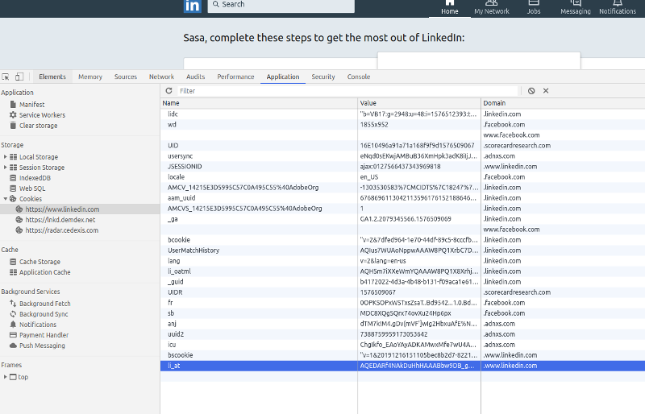

# Summary
> Transform Linkedin in private API to execute automated action that a human would do.

# Business case
As a sale man, I want to connect with a selected linkedin profile with a custom message. Three days later, I check if this connection is accepted or not. If yes, I send a follow-up message. If not, I send an email

# API
Authorization: Basic token 

Endpoint: http://localhost/linkedin/connection-request

Input:
- Linkedin sender (Name)
- Cookie Linkedin from who the connection request will be send
- Linkedin url to which I want to connect with
- Custom message

Output:
- CONNECTION_REQUEST_PENDING
- ONLY_FOLLOW_BUTTON
- ONLY_MESSAGE_BUTTON
- CONNECTION_REQUEST_SUCCESS

# MongoDB

If possible, do not use Mongoose.
For each connection request, save the action in the following schema:
- creatatedAt
- linkedinReceiver
- linkedinConnectionRequestMessage
- linkedinSender
- status (see output above)

## Linkedin behavior to verify
- Is the sender already in contact with the receiver
- Case when the "pending" status is present (already added)
- Case when you need to use the (...) button before and add them from there
- Case when this people have only the message button visible (already connected with)
- Case when this people have only the follow button visible

Similar script: https://github.com/RobinHerzog/api-store/blob/master/store/LinkedIn%20Network%20Booster/LinkedIn%20Network%20Booster.js


## Installation

```bash
$ git clone git@github.com:RobinHerzog/upwork-linkedin-automation.git
$ cd upwork-linkedin-automation
$ npm install
```


## Ports & Environments

Ports defined in /config/env/ files.

- 6991 - development
- 6992 - stage
- 6993 - production


## Development

Development is done by **./webpack.config.js** with enabled watch files.
You might have to install nodemon first: `npm install -g nodemon`.

```
// run in first terminal
$ export NODE_ENV=development
$ npm run dev
or
$ npm run dev-verbose (for more detailed error messages)

// open another terminal and run
$ nodemon ./dist/server.js
or just
$ npm run serve
```


## Builds

Builds are done by **./webpack-build.config.js** where watch files are disabled.

- `npm run build:development` and then `npm run serve`
- `npm run build:stage` and then `npm run serve`
- `npm run build:production` and then `npm run serve`


## Endpoints

- POST /v1/linkedin/connection-request
```json
{
  "cookie_li_at": "AQEDARf4NAkDuHhHAAABbw9DB_gAAAFvM0-L-...",
  "li_profile_id": "emrick-coombs-bb0199183",
  "message": "Hello, I want to make connection with you.",
}
```
*NOTICE:* Use Chrome dev tool - Application - Cookies to get value of "li_at" cookie and fill "cookie_li_at". Cookie "li_at contains login token."



## LICENCE
Copyright by [Robin Herzog](LICENSE)
